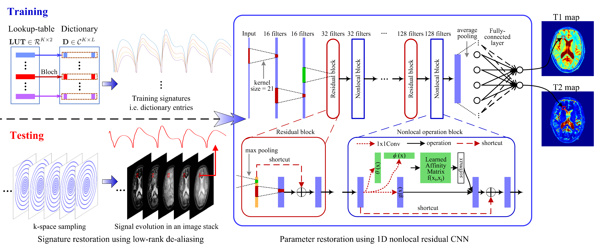

# HYDRA: Hybrid deep magnetic resonance fingerprinting

----------------------------

The software is for the paper "HYDRA: Hybrid deep magnetic resonance fingerprinting". The source codes are freely available for research and study purposes.

Purpose: 
    Magnetic resonance fingerprinting (MRF) methods typically rely on dictionary matching to map the temporal MRF signals to quantitative tissue parameters. Such approaches suffer from inherent discretization errors, as well as high computational complexity as the dictionary size grows. To alleviate these issues, we propose a HYbrid Deep magnetic ResonAnce fingerprinting (HYDRA) approach, referred to as HYDRA.

Methods: 
    HYDRA involves two stages: a model-based signature restoration phase and a learning-based parameter restoration phase. Signal restoration is implemented using low-rank based de-aliasing techniques while parameter restoration is performed using a deep nonlocal residual convolutional neural network. The designed network is trained on synthesized MRF data simulated with the Bloch equations and fast imaging with steady-state precession (FISP) sequences. In test mode, it takes a temporal MRF signal as input and produces the corresponding tissue parameters.

Reference:
----------------------------
If you use the source codes, please refer to the following papers for details and thanks for your citation.

[1] Pingfan Song, Yonina C. Eldar, Gal Mazor, Miguel R. D. Rodrigues, "HYDRA: Hybrid Deep Magnetic Resonance Fingerprinting", Medical Physics, 2019, doi: 10.1002/mp.13727. 

[2] Pingfan Song, Yonina C. Eldar, Gal Mazor, Miguel R. D. Rodrigues, "Magnetic Resonance Fingerprinting Using a Residual Convolutional Neural Network", ICASSP, pp. 1040-1044. IEEE, 2019.

Usage:
----------------------------

- Run the code 'Gen_D_LUT.m' in the folders 'HYDRA_Step1_Gaussian' or 'HYDRA_Step1_Spiral' to generate simulated dictionary and look-up-table.
- Run the code 'HYDRA_Step1.m' in the folders 'HYDRA_Step1_Gaussian' or 'HYDRA_Step1_Spiral' to perform the first step of HYDRA: reconstruct temporal signatures via using adapted FLOR algorithm. After the temporal signatures are reconstructed, they are input into the trained neural network to restore the parameter maps, i.e. the second step of HYDRA. (Please refer to 'MRF_FullNL_ResCNN_T1T2_L1000_Test.py' for the second step).
- Run the code 'MRF_FullNL_ResCNN_T1T2_L1000_Train.py' to train the designed nonlocal residual CNN.
- Run the code 'MRF_FullNL_ResCNN_T1T2_L1000_Test.py' to test the network on following cases:
  - case 1: Testing on the synthetic dataset for comparing parameter restoration performance, i.e. testing on simulated MRF temporal signals.
  - case 2: Testing on the anatomical dataset with full k-space sampling for comparing parameter restoration performance.
  - case 3: Testing on the anatomical dataset with k-space subsampling factor 15% using Gaussian patterns. 
  - case 4: Testing on the anatomical dataset with k-space subsampling factor 9% using Spiral patterns.

Note, some datasets can also be downloaded from following addresses:

- training dataset: *[training dataset: D_LUT_L1000_TE10_Train.mat](https://imperiallondon-my.sharepoint.com/:u:/g/personal/psong_ic_ac_uk/ER9TouxAzAVPumFLOW5bJqQBr_FzxnDOxyNJNyFySuDphQ?e=ZtGRWm)*  (password: 666)
- anatomical dataset with full k-space sampling: [MRF_ImageStack_N128_L1000_TE10_Ratio0.15.mat](https://imperiallondon-my.sharepoint.com/:u:/g/personal/psong_ic_ac_uk/EWAPm9ar4UtMomsUpU9cvy8BGwEsQcuT8A9WC19Uc9-V5w?e=qNTl1h)
- anatomical dataset with k-space Gaussian sampling: [X_FLOR_Gaussian_Ratio0_15_L1000.mat](https://imperiallondon-my.sharepoint.com/:u:/g/personal/psong_ic_ac_uk/EeraTvnuI4VPi2oSXMp999QB50pf7LAMq67EvDPmw-sf5A?e=aYH3eO)
- anatomical dataset with k-space Spiral sampling: [X_FLOR_Spiral_Ratio0_09_L1000.mat](https://imperiallondon-my.sharepoint.com/:u:/g/personal/psong_ic_ac_uk/EexXep8aPuNIj9a7NTGpUYgB8XzuHjHZ2fORQXxjkbrRBA?e=5Ovyjy)

Codes written & compiled by:
----------------------------
Pingfan Song 

Electronic and Electrical Engineering, Imperial College London, UK.

p.song@imperial.ac.uk, songpingfan@gmail.com

Some introduction and results:
----------------------------

Figure 1: Forward and Backward Model for MRF. The MR contrast matrix X is associated with the k-space measurements Y per column by the subsampled Fourier transform. It is related to tissue parameters Theta^{T12} per row by the Bloch equations. Given Theta^{TRE} and Y, the image stack X is commonly first reconstructed from Y, referred to as signature restoration, and then mapped to tissue parameters Theta^{T12} via dictionary matching, referred to as parameter restoration. 

Figure 2: Diagram of the proposed MRF reconstruction approach. During the training stage, synthesized dictionary entries are used as training signatures to train the designed 1D nonlocal residual CNN until the outputs approximate parameter values in **LUT** well. In this way, the network captures the signature-to-parameter mapping. During the testing stage, a low-rank based algorithm is used to restore the image stack, a matrix containing signatures in rows, from k-space measurements. Then the restored signatures are input into the trained network to obtain corresponding tissue parameters directly.

Figure 3: Testing on the anatomical dataset with full k-space sampling for comparing parameter restoration performance. Each subfigure shows the deviations of the estimation from the reference. Parameter mapping performance using HYDRA outperforms competing methods significantly, resulting in smaller deviations. 

Figure 4: Visual results of testing on anatomical dataset with full k-space sampling for comparing parameter restoration performance. Top two rows correspond to T1 maps and residual errors while bottom two rows correspond to T2 maps and residual errors. Proposed HYDRA results in comparable performance for T1 mapping and yields much better performance for T2 mapping, obtaining 10dB higher SNR gains than competing dictionary-matching based methods. HYDRA also outperforms previous networks.

Figure 5: Testing on the anatomical dataset with k-space subsampling factor 15\% using Gaussian patterns and 1000 time frames.

Figure 6: Visual results of testing on anatomical dataset with k-space subsampling factor 15\% using Gaussian pattern with L=1000.

Figure 7: Testing on the anatomical dataset with k-space subsampling factor 9\% using spiral trajectories and 1000 time frames.

